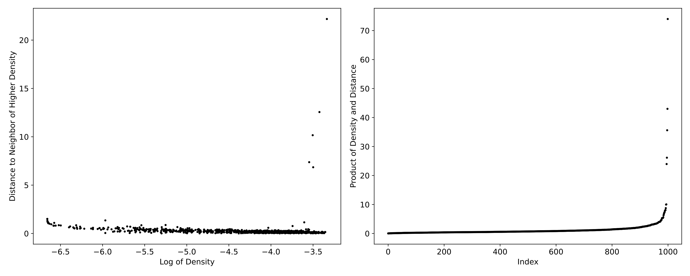

# Reinforced EM Algorithm for Clustering with Gaussian Mixture Models

This is the official implementation of *Reinforced EM*.


Reinforced EM (REM) is a algorithm for clustering with Gaussian Mixture Models (GMMs) that approximates cluster centres by medoids/exemplars. It applies a fast density-peak-finding technique to generate an inclusive set of initial exemplars from the data pool; then an efficient pruning strategy is used to remove redundant exemplars. The pruning strategy is carried out by penalizing a convex objective function that is well justified in the context of mixture modelling. 

## Brief Usage

Given some data points:

```python
from sklearn.datasets import make_blobs

# Generate a Gaussian mixture data set
X, y = make_blobs(n_samples = 1000, centers = 5, shuffle=False)
```

REM has similar structure to sklearn mixture methods:

```python
from REM import REM

# Initialize the REM object with model selection criteria.
Cluster = REM(criteria = "all", bandwidth = "spherical")

# REM's fit method produces a decision graph from which exemplars are selected. 
Cluster.fit(X)
```

```python
#REM prompts selection of which decision graph to use, 1 for left and 2 for right. 

#Next REM prompts entering the threshold values for exemplar selection. 

#The clusterings are contained in the mixtures item of the REM object. 
Cluster.mixtures

#To determine the optimal clustering, the AICs, BICs and ICLs are available. 
Cluster.aics_

Cluster.bics_

Cluster.icls_

#Assigning the optimal mixture to a new object. 
Mix = Cluster.mixtures[0]

```


The `Mix ` object now contains the following members:

Member | Description
--- | ---
`n_components` | Number of components in the mixture
`weights_` | Mixing proportions of the components
`means_` | Component mean vectors
`covariances_` | Component covariance matrices
`n_iter_` | Number of iterations taken for EM algorithm to converge
`lower_bound_` | Log-likelihood of the mixture

```python
#To predict the labels of the dataset, use the mixture's predict function. 
y_pred = Mix.predict(X)

```


You may also try adjusting the parameters of CMS:

Parameter | Description
--- | ---
``criteria`` | Assessment criteria to return. Options are 'none', 'aic', 'bic', 'icl' or 'all'. 
``max_components`` | If set to an int, this parameter skips the decision graph step and uses the instances with the largest value of $f_h(x)\omega(x)$ in the data. 
``bandwidth`` | Options for selecting the bandwidth and kernel method. Options: "spherical" computes a spherical kernel with bandwidth equal to 1/100 of the average variance in each direction in the data; "diagonal" performs the statsmodels.nonparametric.KDEMultivariate normal reference method; setting the bandwidth equal to an integer uses an adaptive $k$-NN bandwidth; and setting the bandwidth equal to a float uses that value as the bandwidth. 
``tol`` | Convergence tolerance for the log-likelihood used in the EM algorithm. 
``max_iter`` | Maximum number of iterations of each run of EM. 


## Requirements

REM requires the following Python libraries to be installed on the system: numpy, scipy, sklearn, statsmodels, matplotlib, and rpy2. 

REM currently implements the overlap computation contained in the MixSim package in R. As a result, it is required to have R installed on your machine, and the MixSim package installed. In future update, we will remove this dependency by implementing the overlap computation in a C library. 

## Experiments

To evaluate performance on the classification datasets included in our work, run `python REM_real.py`. The results will be saved to `REM_real.csv`. 


## Update 11/01

Work is ongoing to improve the REM library. In the coming months, the function from the R library MixSim will be incorporated natively in Python. Further improvements to function structure, and input and output processing to improve comparitability with scikit-learn are in train.
